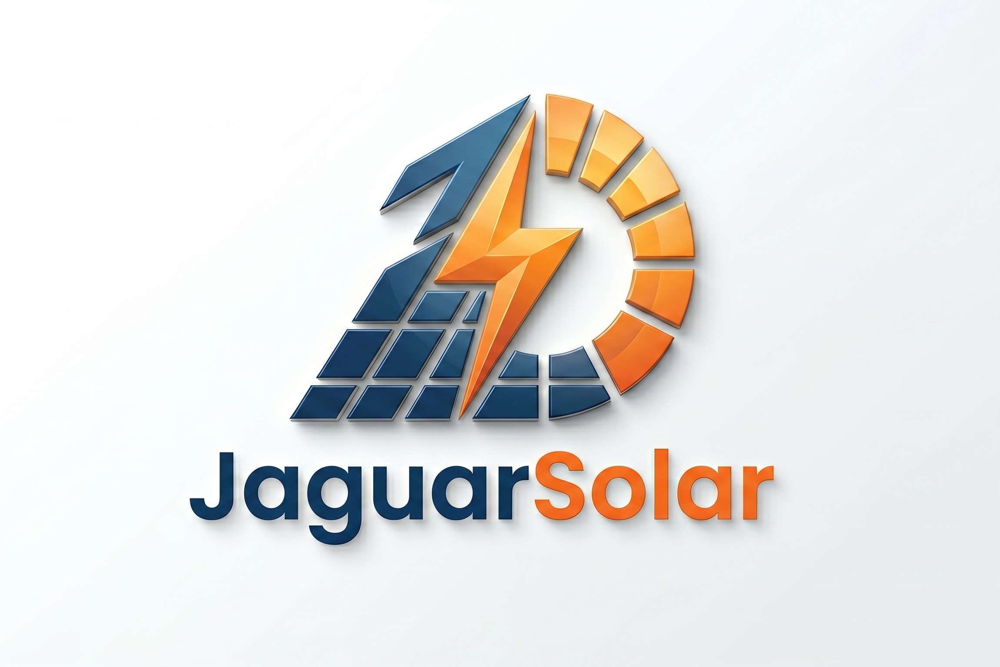

# ☀️ JaguarSolar - Plataforma de Dimensionamento e CRM

**Autor:** Genivaldo Marques de Oliveira Neto  
**Instituição:** Instituto Federal do Ceará (IFCE) - Campus Jaguaruana  
**Curso:** Análise e Desenvolvimento de Sistemas (ADS)  
**Disciplina:** Programação Web I  

---

## 📌 1. Visão Geral do Projeto

O **JaguarSolar** é um sistema web focado na gestão comercial de empresas de energia solar fotovoltaica. A plataforma atua como uma ferramenta de automação de vendas, permitindo que consultores e representantes comerciais calculem o dimensionamento de sistemas de geração de energia, emitam propostas financeiras estimadas e gerenciem o agendamento de vistorias técnicas.

O software foi concebido com uma arquitetura dividida entre uma **API RESTful** no Back-end e uma **Interface de Usuário (UI/UX)** moderna, baseada no conceito de *Glassmorphism* (Efeito Vidro) no Front-end.

---

## 🚀 2. Tecnologias e Ferramentas Utilizadas

### Front-end (Interface Visual)

* **HTML5 Semântico:** Estruturação limpa e acessível.
* **CSS3 Avançado:** Uso de variáveis globais (CSS Custom Properties), Flexbox, Grid Layout, animações via `@keyframes` e efeito *Glassmorphism* (`backdrop-filter`).
* **JavaScript (Vanilla JS):** Lógica de estado, consumo da API via `Fetch API`, manipulação dinâmica do DOM e validação de formulários.
* **Phosphor Icons:** Biblioteca de ícones vetoriais.

### Back-end (API REST)

* **Node.js:** Ambiente de execução JavaScript no servidor.
* **Express.js:** Micro-framework para roteamento e gerenciamento de requisições HTTP.
* **CORS:** Middleware para controle de compartilhamento de recursos entre origens.
* **Node-Postgres (`pg`):** Driver oficial para comunicação com o banco de dados.

### Banco de Dados

* **PostgreSQL:** Sistema de gerenciamento de banco de dados relacional (SGBDR).

---

## ⚙️ 3. Arquitetura do Sistema e Padrões de Projeto

* `database.js`: Isola a configuração e o pool de conexão com o PostgreSQL.
* `repository.js`: Camada de acesso a dados (Data Access Object - DAO). Contém todas as instruções e consultas SQL puras (Queries).
* `controller.js`: Camada de regras de negócio. Processa os dados, executa cálculos (ex: conversão de kWh para quantidade de painéis) e define as respostas HTTP.
* `index.js`: Ponto de entrada (Entry point) responsável por instanciar o servidor e mapear as rotas da API.

---

## 🛠️ 4. Funcionalidades Implementadas (CRUD Completo)

### Módulo de Indicadores (Dashboard)

* **`GET /api/dashboard` (Read):** Consolida métricas globais em tempo real, calculando o volume de clientes ativos, somatório financeiro do pipeline de vendas (R$) e a contagem de vistorias pendentes.

### Módulo de Propostas Comerciais

* **`POST /api/propostas` (Create):** Processa o formulário principal. Verifica se o cliente já existe pelo e-mail; caso não exista, cadastra-o automaticamente. Em seguida, calcula a geração anual necessária, a quantidade exata de módulos solares e o CAPEX (investimento estimado), salvando a proposta vinculada ao cliente.
* **`GET /api/propostas` (Read):** Retorna o histórico completo de propostas, incluindo dados aninhados (JOIN) do cliente e o status da vistoria técnica.
* **`DELETE /api/propostas/:id` (Delete):** Remove permanentemente uma proposta do sistema. Através da restrição `ON DELETE CASCADE` no banco de dados, limpa automaticamente as vistorias dependentes.

### Módulo de Vistorias Técnicas (Agenda)

* **`POST /api/visitas` (Create):** Vincula uma nova data de vistoria técnica a uma proposta existente.
* **`PUT /api/visitas/:id/status` (Update):** Permite a transição de estado da vistoria (ex: marcando-a como "Concluída") via botões de ação rápida na interface.
* **`PUT /api/visitas/:id` (Update):** Modifica a data programada para a vistoria, exibindo componentes dinâmicos de calendário.

### Experiência do Usuário (UI/UX)

* **Notificações Flutuantes (Toasts):** Sistema de alertas não intrusivos no canto da tela para feedback de operações bem-sucedidas ou falhas.
* **Busca em Tempo Real (Live Search):** Filtro inteligente construído com JavaScript que varre as linhas do CRM instantaneamente à medida que o usuário digita.
* **Design Responsivo & Assíncrono:** Bloqueio inteligente de botões durante o consumo da API (Loading Spinners) para evitar envios duplicados e adaptação de blocos dinâmicos baseados no estado das variáveis.

---

## 📊 5. Diagrama Relacional do Banco de Dados

O banco de dados `jaguarsolar` é composto por três entidades relacionais principais:

1. **`cliente`:** Armazena os dados primários (`id_cliente`, `nome`, `email`, `consumo_mensal_kwh`).
2. **`proposta_solar`:** Possui FK para a tabela de clientes e armazena os dados técnicos de engenharia e custos (`id_proposta`, `id_cliente`, `qtd_paineis`, `geracao_anual_kwh`, `valor_estimado`).
3. **`visita_tecnica`:** Possui FK para o orçamento e faz a gestão da logística (`id_visita`, `id_proposta`, `data_visita`, `status`).

---

## 💻 6. Guia de Instalação e Execução Local

Siga as instruções abaixo para espelhar o ambiente de desenvolvimento localmente.

### Passo 1: Configuração do Banco de Dados

1. Certifique-se de ter o PostgreSQL operando na sua máquina na porta padrão `5432`.
2. Crie um banco de dados denominado `jaguarsolar`.
3. Abra a ferramenta de Query Tool (ou `psql`) e execute integralmente os comandos DDL presentes no arquivo `/database/schema.sql`.

### Passo 2: Inicialização do Back-end

1. Navegue até a pasta raiz do servidor via terminal: `cd backend`.
2. Instale as dependências da aplicação rodando: `npm install`.
3. Abra o arquivo `/backend/database.js` e verifique a sua *connection string*, substituindo a senha padrão (`3012`) pela senha do seu usuário PostgreSQL local.
4. Inicie o servidor da API com o comando: `npm run start` (ou `node index.js`). Você receberá a mensagem confirmando a execução na porta 8080.

### Passo 3: Inicialização do Front-end

1. Com a API rodando, navegue até o diretório `/frontend`.
2. Não há necessidade de build. Basta abrir o arquivo `index.html` diretamente no seu navegador de preferência ou, se estiver utilizando o VS Code, clicar em "Go Live" através da extensão *Live Server*.
3. O sistema estará totalmente integrado e funcional.
